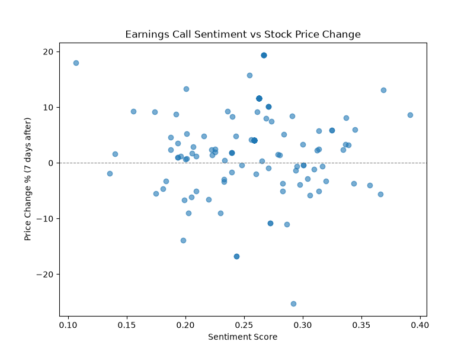

# Does Earnings Call Sentiment Predict Stock Price Movement?

I wanted to test something I'd always wondered about: when a CEO sounds 
upbeat on an earnings call, does that actually mean anything for the stock 
price afterward? Or is it just noise?

## The question

Specifically: if I measure how positive or negative the language is in an 
earnings call transcript, does that tell me anything about where the stock 
price goes in the next day, week, or month?

## What I used

- **148 earnings call transcripts** from 10 companies (2019-2023), covering 
  tech, finance, retail, healthcare, and energy — pulled from a public 
  Motley Fool transcript dataset
- **Daily stock prices** for each company, pulled with the `yfinance` 
  library

## What I did

1. Matched each transcript to its company's stock price on the call date, 
   then 1 day, 7 days, and 30 days later
2. Ran sentiment analysis on the transcripts using VADER

   One thing I learned the hard way: scoring the *whole* transcript at once 
   gave every single call a sentiment score of basically 1.0 — useless. 
   VADER isn't built for documents that long. Splitting each transcript 
   into sentences and averaging the scores fixed this and gave much more 
   realistic numbers.

3. Checked the correlation between sentiment score and price change, at 
   all three time windows

## What I found

Basically no relationship, at any time window:
- 1 day after: r = 0.07
- 7 days after: r = 0.03
- 30 days after: r = -0.08

All of these are close enough to zero that I can't say sentiment predicts 
price movement here.

I did notice a few individual companies with bigger swings — JPM showed 
r = -0.73, for example. But those are based on only 8-11 calls each, which 
is too small to trust. The one company I had real volume for, Apple 
(62 calls), matched the overall pattern almost exactly: no relationship.

## Why I think this makes sense

By the time a CEO is speaking on the call, the actual numbers are already 
out — investors already know revenue, profit, guidance. The tone of how 
it's delivered probably doesn't add much on top of that. Also, almost 
every call I analyzed scored positive (0.10 to 0.39 on a -1 to 1 scale) — 
executives are just trained to sound optimistic no matter what, which 
makes it hard to find a pattern even if one exists.

## What I'd do differently next time

- Use a finance-specific sentiment model like FinBERT instead of VADER, 
  which is more general-purpose
- Get a lot more data — 148 calls is a decent start but not enough to be 
  confident about smaller subgroups
- Check if sentiment predicts *volatility* instead of direction — maybe 
  uncertain language causes bigger price swings either way, even if it 
  doesn't predict which direction

## Tools

Python, pandas, yfinance, VADER (NLTK), matplotlib

## Try it yourself
This includes a simple Streamlit app where you can paste any earnings call text and see its sentiment score.
Run locally with:

pip install -r requirements.txt

streamlit run app.py